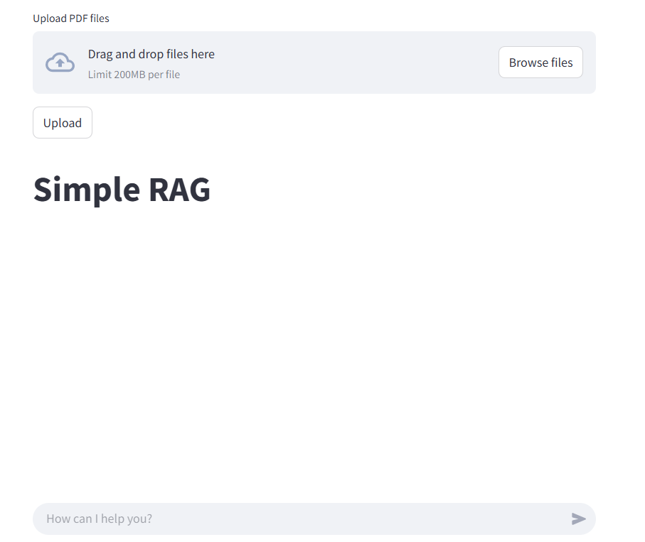

# Simple RAG


## 🚀 About
A simple RAG that uses langchain, Chromadb, fastAPI, and streamlit. Allows the user to upload documents which are stored in a persistent vector database, has a chat bot UI.



The project has the following file structure:
```
.
├── corpus          # create and insert the database file in this folder
├── src                                       
│   ├── extracted_text       # folder path specified in conf.yaml      
│   ├── pdf_extracted_imgs   # folder path specified in conf.yaml        
│   ├── uploaded_docs        # folder path specified in conf.yaml    
│   ├── vector_store         # folder path specified in conf.yaml 
│   ├── utils
│   │   └── config.py
│   ├── backend.py
│   ├── dataloader.py
│   ├── embedder.py
│   ├── frontend.py
│   ├── generator.py
│   ├── retriever.py
│   └── vectorstore.py     
├── conf.yaml               # config files for running the pipeline
├── requirements.txt
├── README.md
└── .env                    # keep all api keys here    

```
## 📝 Installation & Usage

To install and run,

```bash

# create a virtual environment and activate it
python -m venv venv

# install dependencies
pip install -r requirements.txt

# to start the front end, in a terminal, 
streamlit run frontend.py

# to start the back end, in a terminal, 
uvicorn backend:app --reload

# open http://127.0.0.1:8501 to access the frontend
```
    
## 📚 Pipeline Description

**dataloader.py**:   
This module contains the Dataloader class which handles the loading and processing of raw data into text data ready for embedding. This class requires the folder paths of the data sources and output directories for processed data as well as the vision model to process the images   

**embedder.py**:  
This module contains the Embedder class which handles the embeding of text data that was processed by the dataloader. The get_embeddings method returns a the embedded data to be stored in the vectorstore.

**vectorstore.py**:  
This module contains the Vectorstore class which connects to a persistent chromadb vector database and stores all the embeddings from the embedder inside. To reuse the vectorstore, the collection name and folder path for the vectorstore has to be same in the conf.yaml file.  

**retriever.py**:  
This module contains the Retriever class. This class takes an input query and connects to the Vectorstore to retreive all the relevant documents related to the query, only the top 3 relevant documents will be returned. Will be made as a user configurable parameter in future.

**generator.py**:  
This module contains the Generator class which takes in the user query and relevant documents from the retriever to provide a response from the user specified LLM model.  

**frontend.py**:  
This module contains the streamlit integration for the front end. It contains an interface for the user to upload documents and a chatbot like UI

**backend.py**:  
This module contains the fastAPI integration which connects to the front end. It contains the backend logic for updating the vector database using the modules above and the prediction logic based on a user query
## ⚙️ TODO
 - Add support for more LLMs and models
 - Add support for other raw data sources such as audio and csv
 - Improve the streamlit UI, add features like loading indicators when the vector DB is updating"# RAG" 
